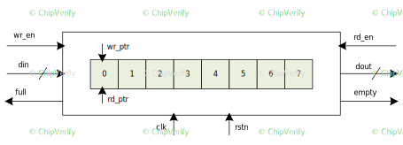
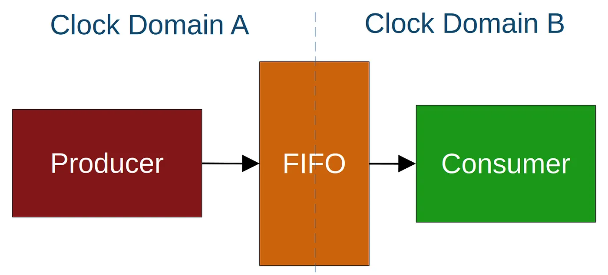

# FIFO (First In First Out)

- Ensures that data is processed in the order it was received, which is critical for maintaining data integrity.

## Functional Requirements

### Parameters 
- WIDTH parameter

- DEPTH parameter
    - Must be a power of 2 for efficient addressing.

### Reset Behavior

- Asynchronous active-low reset

- Reset clears all pointers and flags

### Write Operations

- Synchronous to rising edge of clock

- Data written only when wr_en_i is asserted and FIFO is not full

- Writes ignored when FIFO is full

- Writer pointer increments after successfull write

### Read Operations

- Synchronous to rising edge of clock

- Data always available on output port

- Read pointer increments only when rd_en_i is asserted and FIFO not empty

- Reads ignored when FIFO is empty

### Status flags

- full_o: Asserted when FIFO cannot accept more data

- empty_o: Asserted when FIFO has no valid data

## Synchronous FIFO 
Its synchronized clock to control the read and write operations. 

The read and write pointers of the FIFO are updated *synchronously* with the clocks, and data is transferred betweem the FIFO and the external circuit synchronously with the clocks.

Inputs and outputs are:

This ones are used to buffer data when the rate of data transfer exceeds the rate of data processing.

## Depth and width.
The depth of the FIFO refers to the total number of data entries it can hold at any given time.  

It determines how many data elements the FIFO can temporarily store while the writer and reader are running at different speeds. 

This is important because writer and reader do NOT operate at the same rate. FIFO help with that mismatch.

$$
\text{Depth} = \frac{\text{Writing Rate} - \text{Reading Rate}}{\text{Clock Frequency}}
$$

## I/O ports

Some of the most important ports are:

1. Status Flags: Indicates when is *FULL* and no more data can be written until some is read.

2. Write and read data ports signals, writer is the input while reader is the output of the data to be read. 

3. Read and Write pointers.

## Problem Statements of a FIFO
1. **Data Loss**: CPU writes data at high rate, while a slow peripheral (e.g. UART Transmitter) reads data at a lower rate. Without a buffer, data written would arrive faster than the peripheral could read, causing data loss. *FIFO acts as a buffer between mismatched data rates.*

2. **Clock Domain Crossing**: Having multiple clock domains, makes transferring data from one clock domain to another cause metastability and data corruption. Introducing a FIFO provides safe data transfer between clock domains, eliminating metastability and maintaining data integrity across frequency boundaries. 

